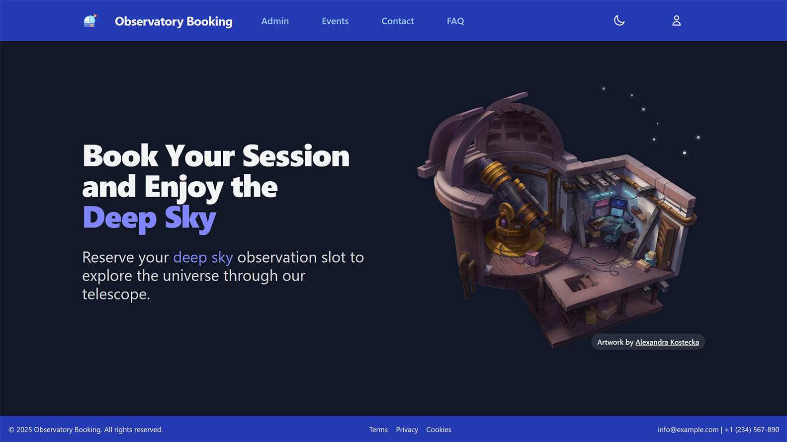
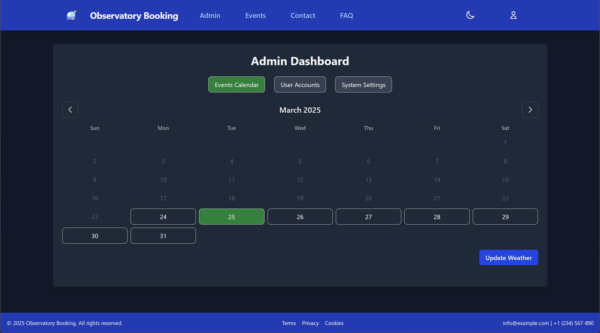
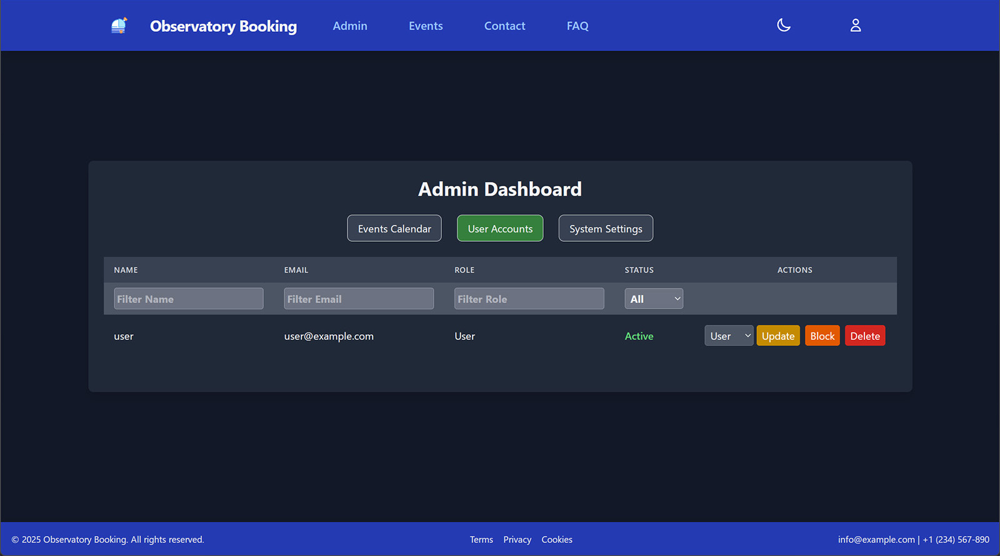
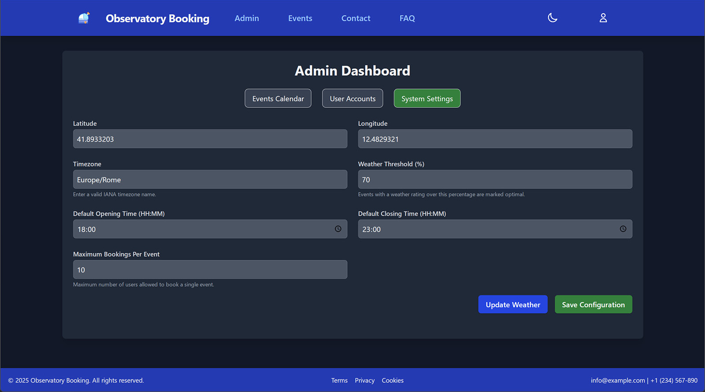
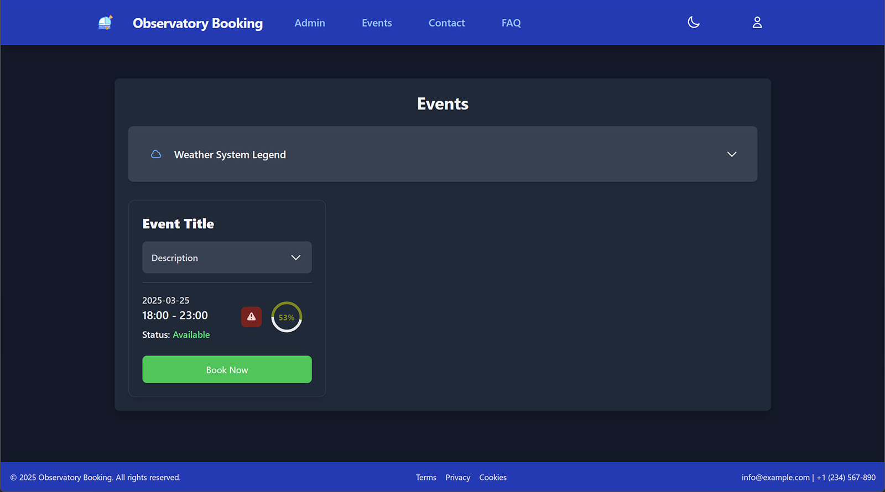
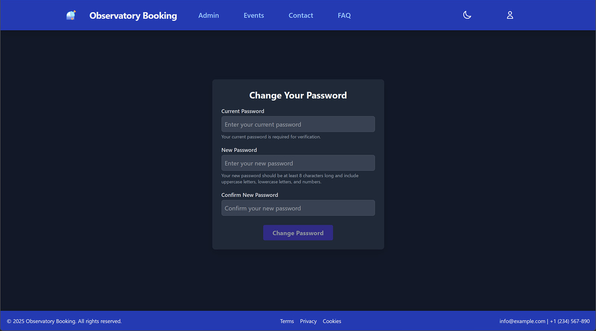
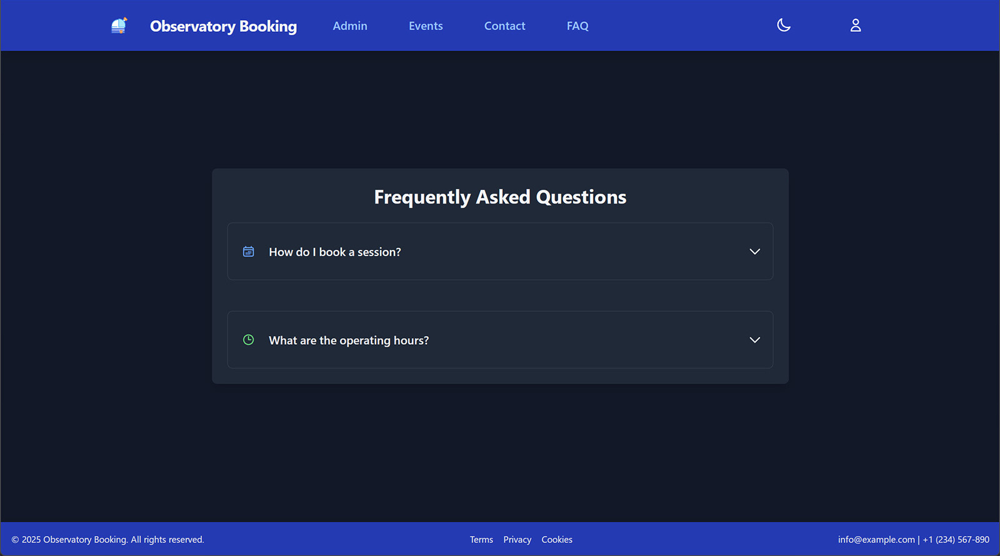
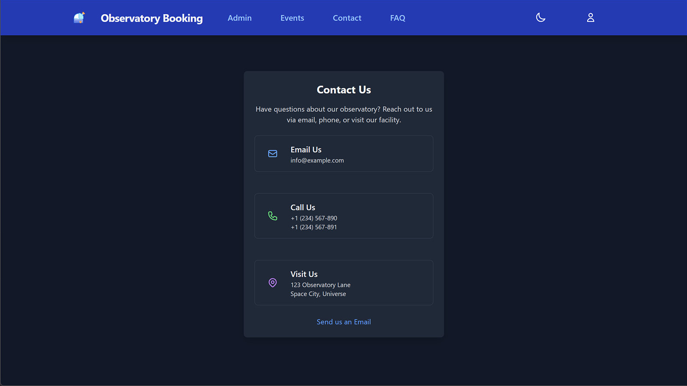

<h1 align="center">
  <sub>
    
  </sub>
  Observatory Booking Web App
</h1>

<p align="center">
  <em>A Flask-based, self-hostable <strong>observatory booking web app</strong> with role-based access control, weather-aware scheduling, and encrypted user data. Built with <strong>Tailwind CSS</strong> for a modern, responsive UI.</em>
</p>

<p align="center">
  
</p>

<p align="center" style="font-size: 0.95rem; color: #555;">
  <strong><i>Artwork by <a href="https://alexrockheart.artstation.com/" target="_blank" rel="noopener noreferrer" style="color: #4f46E5;">Alexandra Kostecka</a></strong></i>
</p>

<h2 align="center">📊 Project Status & Tech Stack</h2>

<div align="center">
  <p>
    <a href="https://github.com/EdoardoTosin/Observatory-Booking/actions/workflows/code-quality.yml"></a>
  </p>

  <p>
    <a href="LICENSE"></a>
    <a href="https://www.python.org/"></a>
    <a href="https://edoardotosin.github.io/Observatory-Booking"></a>
  </p>

  <p>
    <a href="https://flask.palletsprojects.com/"></a>
	<a href="https://www.sqlite.org/index.html"></a>
    <a href="https://tailwindcss.com/"></a>
  </p>
</div>

## 🚀 Features

- **User Management**
  - Secure registration and authentication (password hashing with bcrypt).
  - Role-based access control (User, Admin, Superadmin).
  - Rate-limited requests to prevent abuse (10 requests per 20 seconds).

- **Admin Panel**
  - Manage users: block/unblock, assign roles, delete user accounts (Superadmin only).
  - Update global system configurations.
  - Create or modify event with weather-aware logic.

- **Event Booking**
  - Book or cancel observatory events with enforced limits.
  - Automated weather integration (via Open-Meteo API) to assess event suitability.
  - Timezone-aware event scheduling.

- **Weather Service**
  - Fetch and cache forecasts every 3 hours.
  - Evaluate weather conditions (cloud cover, precipitation, visibility).

- **System Security**
  - AES-encrypted personal data.
  - Concurrency-safe operations with thread locking.
  - Deleted users are automatically logged out upon next request.

- **Modern UI**
  - Tailwind CSS and PostCSS for responsive and customizable styling.
  - Mobile-friendly interface.

## 📸 Screenshots

### Admin Pages

| Events Management | User Management | System Configuration |
|-------------------|-----------------|----------------------|
|  |  |  |

### User Pages

| Events Booking | Change Password |
|----------------|-----------------|
|  |  |

### Other Pages

| FAQ | Contact Us |
|-----|------------|
|  |  |

## 📦 Prerequisites

- **Python 3.9+**
- **SQLite** (default, or PostgreSQL via `DATABASE_URL`)
- (Optional) Reverse proxy (e.g., Nginx, Apache) for production deployments.

## ⚙️ Setup Instructions

### 1. Clone the Repository

```bash
git clone https://github.com/EdoardoTosin/Observatory-Booking
cd Observatory-Booking
```

### 2. Python Setup

```bash
pip install -r requirements.txt
```

### 3. Environment Configuration

Create or update the `.env` file:

```dotenv
DATABASE_URL=sqlite:///observatory_booking.db
DEFAULT_ADMIN_EMAIL=admin@example.com
DEFAULT_ADMIN_PASSWORD=admin
SECRET_KEY=<generate_secret>
AES_SECRET_KEY=<generate_base64_key>
AES_IV=<generate_base64_iv>
FLASK_ENV=development
DEBUG_MODE=True
HOST=0.0.0.0
PORT=5000
WTF_CSRF_ENABLED=False
SESSION_COOKIE_SECURE=False
LOGGING_LEVEL=DEBUG
```

> ⚠️ **Security Tip**: In production, use strong, randomly generated values for `SECRET_KEY`, `AES_SECRET_KEY`, and `AES_IV`. Set `WTF_CSRF_ENABLED=True` and `SESSION_COOKIE_SECURE=True`.

### 4. Start the Application

```bash
python -m app
```

> ℹ️ **Note**: A Superadmin account is automatically created on first run using `.env` credentials.

Visit: `http://127.0.0.1:5000/` or configured `HOST:PORT`.

## 🧩 Configuration Overview

| Setting                 | Description                                       | Default                   |
|-------------------------|---------------------------------------------------|---------------------------|
| `DATABASE_URL`          | Database connection URI                           | `sqlite:///observatory_booking.db` |
| `SECRET_KEY`            | Flask session signing key                         | (required)                |
| `AES_SECRET_KEY`        | Base64 AES key for data encryption                | (required)                |
| `AES_IV`                | Base64 AES initialization vector                  | (required)                |
| `DEFAULT_ADMIN_EMAIL`   | Email for first-time superadmin                   | `admin@example.com`       |
| `DEFAULT_ADMIN_PASSWORD`| Password for first-time superadmin                | `admin`                   |
| `FLASK_ENV`             | Environment mode                                  | `development`             |
| `WTF_CSRF_ENABLED`      | Enable CSRF protection                            | `False` (dev)             |
| `SESSION_COOKIE_SECURE` | Secure cookies over HTTPS                         | `False` (dev)             |
| `LOGGING_LEVEL`         | Log level (DEBUG, INFO, ERROR)                    | `DEBUG`                   |

## 🗓️ User Roles & Permissions

| Role         | Capabilities |
|--------------|--------------|
| **User**     | Book/cancel events, view events, change password |
| **Admin**    | Block/unblock users, update user roles, configure system, events |
| **Superadmin** | Full control: delete users, manage admins, immune to role changes/deletion |

## 🌦️ Automated Weather Updates

- API: [Open-Meteo](https://open-meteo.com/)
- Runs every 3 hours (background scheduler).
- Updates event weather forecast based on:
  - Cloud cover
  - Precipitation
  - Visibility
  - Dew point
- Cached for 3 hours (reduces API load).

## ⏱️ Rate Limiting

- Users: **10 requests per 20 seconds**.
- Applies to login, booking, and cancellation endpoints.
- Prevents system abuse and ensures fair access.

## 🧪 API Endpoints Overview

| Endpoint                       | Method   | Auth Required  | Description                                |
|--------------------------------|----------|----------------|--------------------------------------------|
| `/register`                    | GET/POST | No             | Register new user                          |
| `/login`                       | GET/POST | No             | Login with password                        |
| `/logout`                      | GET      | No             | Logout from user session                   |
| `/change_password`             | GET/POST | Yes            | Change user password                       |
| `/events`                      | GET      | Yes            | View available events                      |
| `/booking`                     | POST     | Yes            | Book an event                              |
| `/cancel_booking/<id>`         | POST     | Yes            | Cancel a booking                           |
| `/admin`                       | GET      | Admin          | Access admin control panel                 |
| `/admin/confirm_event`         | POST     | Admin          | Create/update events                       |
| `/admin/delete_event/<id>`     | POST     | Admin          | Delete event                               |
| `/admin/update_events_weather` | POST     | Admin          | Refresh weather data for all events        |
| `/admin/config`                | POST     | Admin          | Update system configuration                |
| `/admin/user/block`            | POST     | Admin          | Block or unblock a user                    |
| `/admin/user/role`             | POST     | Admin          | Change user role                           |
| `/admin/user/delete`           | POST     | Superadmin     | Permanently delete user account            |

## 📄 License

This project is licensed under the **MIT License**. See the [LICENSE](LICENSE) file for details.
