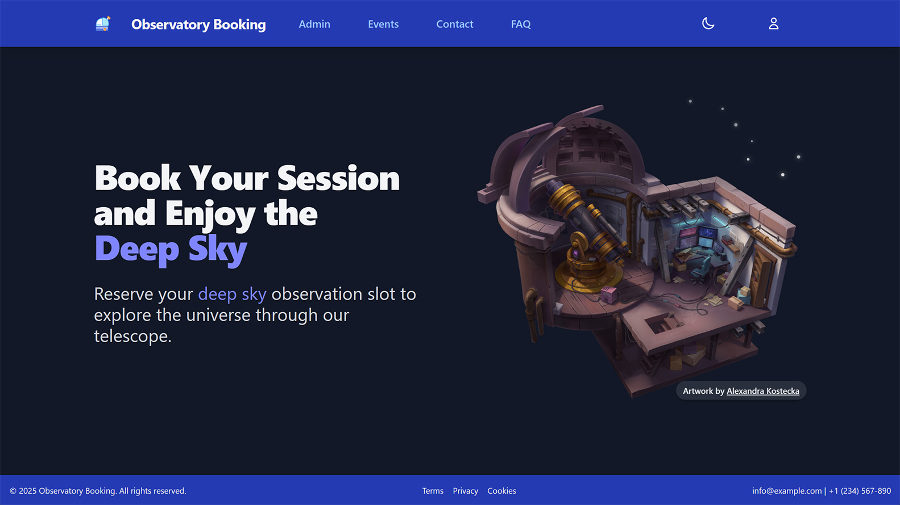
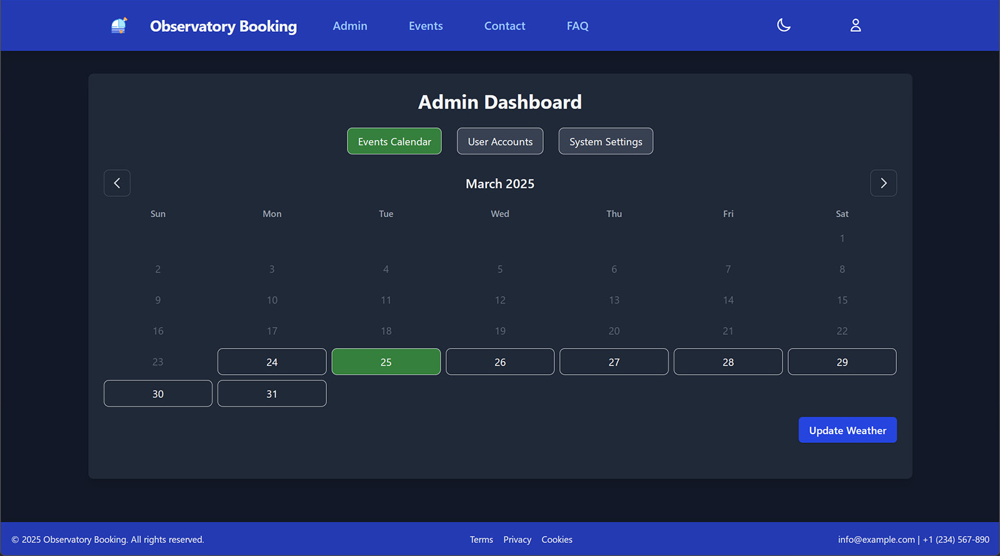
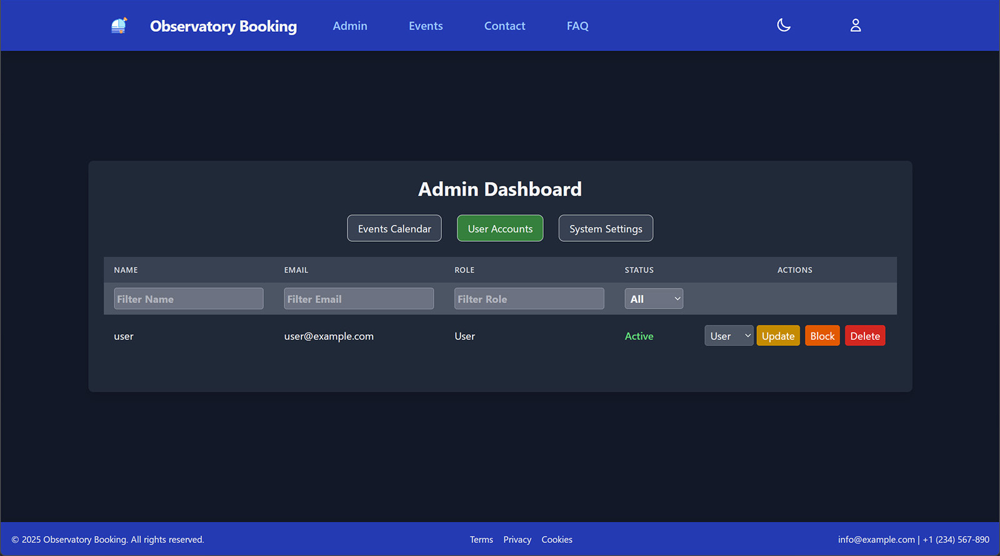
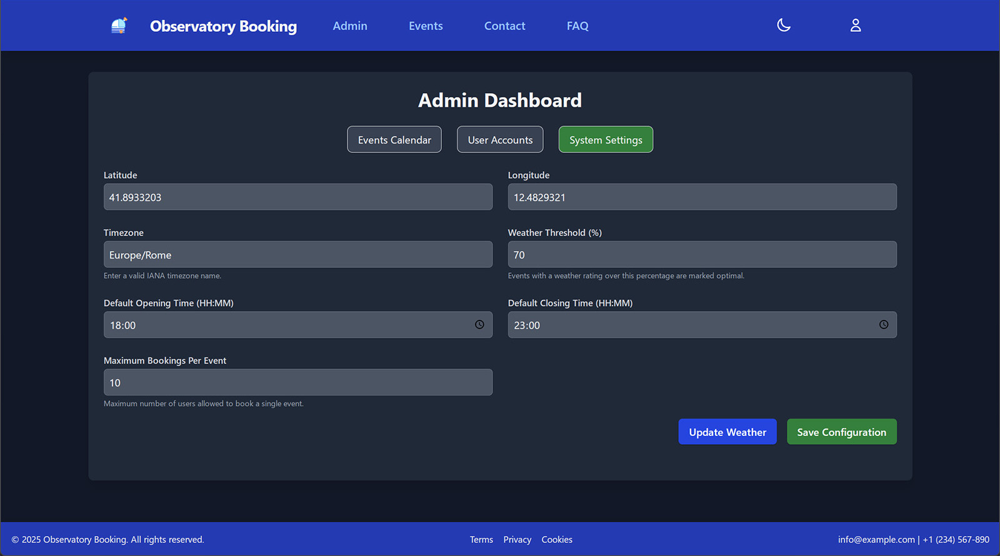
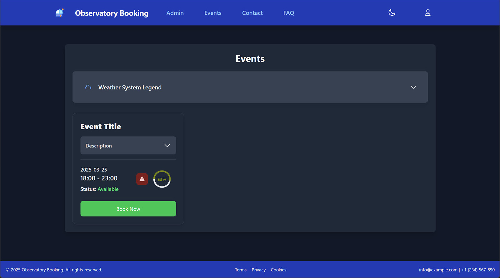
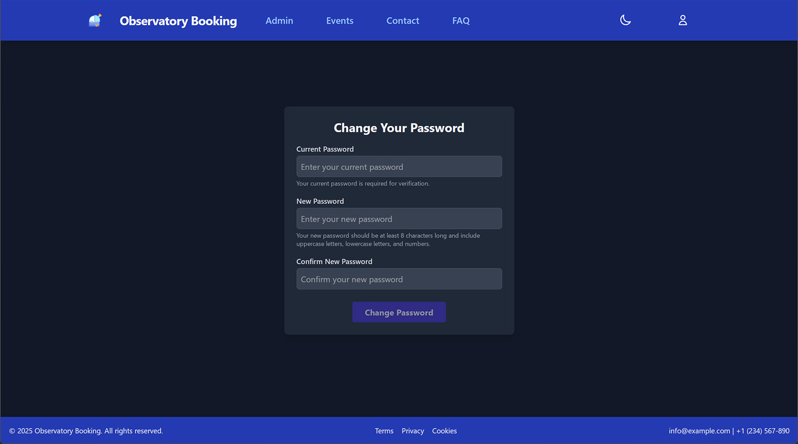
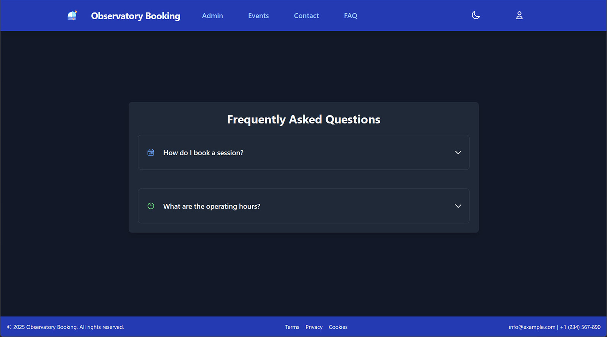
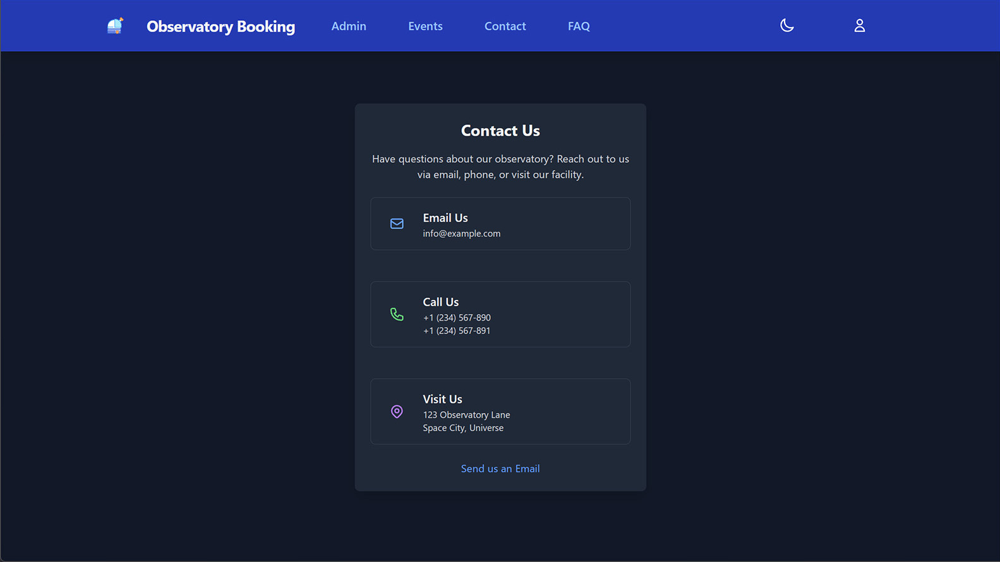

<h1 align="center">
  <sub>
    
  </sub>
  Observatory Booking Web App
</h1>

<p align="center">
  <em>A Flask-based, self-hostable <strong>observatory booking web app</strong> with role-based access control, weather-aware scheduling, and encrypted user data. Built with <strong>Tailwind CSS</strong> for a modern, responsive UI.</em>
</p>

<picture>
  <source media="(prefers-color-scheme: dark)" srcset="assets/screenshots/landing-page-dark-mode.jpg">
  <source media="(prefers-color-scheme: light)" srcset="assets/screenshots/landing-page-light-mode.jpg">
  
</picture>

<p align="center" style="font-size: 0.95rem; color: #555;">
  <strong><i>Artwork by <a href="https://alexrockheart.artstation.com/" target="_blank" rel="noopener noreferrer" style="color: #4f46E5;">Alexandra Kostecka</a></strong></i>
</p>

<h2 align="center">Project Status &amp; Tech Stack</h2>

<div align="center">
  <p>
    <a href="https://github.com/EdoardoTosin/Observatory-Booking/actions/workflows/code-quality.yml"></a>
  </p>

  <p>
    <a href="LICENSE"></a>
    <a href="https://www.python.org/"></a>
    <a href="https://edoardotosin.github.io/Observatory-Booking"></a>
  </p>

  <p>
    <a href="https://flask.palletsprojects.com/"></a>
	<a href="https://www.sqlite.org/index.html"></a>
    <a href="https://tailwindcss.com/"></a>
  </p>
</div>

## Features

- **User Management**
  - Secure registration and authentication (password hashing with bcrypt).
  - Role-based access control (User, Admin, Superadmin).
  - Rate-limited requests to prevent abuse (10 requests per 20 seconds).

- **Event Booking**
  - Search, filter, and browse-by-date UI for finding events, with a
    date-picker calendar and sort by date or weather rating.
  - Book or cancel observatory events with enforced limits.
  - Automated weather integration (via Open-Meteo API) to assess event suitability.
  - Timezone-aware event scheduling.

- **Admin Panel**
  - Paginated, filterable user management: block/unblock, assign roles,
    delete accounts (Superadmin only), with bulk actions across a page of
    selected users or every user matching the current filters.
  - Events Calendar with per-event capacity management: raise/lower the
    booking limit (down to the number already confirmed) or revoke
    individual bookings to free up space.
  - System settings with a curated, continent-grouped timezone picker and
    an interactive map (Leaflet + OpenStreetMap) for setting the
    observatory's coordinates.

- **Weather Service**
  - Fetch and cache forecasts every 3 hours.
  - Evaluate weather conditions (cloud cover, precipitation, visibility, dew point).

- **System Security**
  - AES-256-GCM authenticated encryption for personal data.
  - CSRF protection on all state-changing endpoints, including the JSON API.
  - HTTP security headers (X-Frame-Options, CSP, etc.) on every response.
  - Concurrency-safe operations with thread locking.
  - Deleted users are automatically logged out upon next request.

- **Modern UI**
  - Server-rendered pages (work with JavaScript disabled) progressively
    enhanced via a consistent `/api/v1` JSON API for filtering,
    pagination, and bulk/corrective actions without full page reloads.
  - Tailwind CSS and PostCSS for responsive and customizable styling.
  - Mobile-friendly interface.

## Screenshots

### Admin Pages

| Events Management | User Management | System Configuration |
|-------------------|-----------------|----------------------|
|  |  |  |

### User Pages

| Events Booking | Change Password |
|----------------|-----------------|
|  |  |

### Other Pages

| FAQ | Contact Us |
|-----|------------|
|  |  |

## Prerequisites

- **Python 3.10+**
- **uv**
- **SQLite** (default, or PostgreSQL via `DATABASE_URL`)
- (Optional) Reverse proxy (e.g., Nginx, Apache) for production deployments.

## Setup Instructions

### 1. Clone the Repository

```bash
git clone https://github.com/EdoardoTosin/Observatory-Booking
cd Observatory-Booking
```

### 2. Python Setup

```bash
uv sync
```

### 3. Environment Configuration

Copy `.env.example` to `.env`. Missing cryptographic keys are generated automatically on first start and written back to `.env`; leave `DEFAULT_ADMIN_PASSWORD` empty (a secure one is generated and printed once to stdout on first run). See the [installation guide](https://edoardotosin.github.io/Observatory-Booking/installation.html) for the full variable reference.

```bash
cp .env.example .env
```

> **Security note:** For local HTTP development set `SESSION_COOKIE_SECURE=False`; in production it must be `True` (requires HTTPS).

### 4. Start the Application

```bash
uv run python -m app
```

> **Note:** A Superadmin account is automatically created on first run. Credentials are printed once to stdout; they are never written to log files.

Visit: `http://127.0.0.1:5000/` or configured `HOST:PORT`.

For the full environment variable reference, sample/demo data seeding,
user roles, the weather rating system, rate limiting, and the JSON API
endpoint reference, see the [full documentation](https://edoardotosin.github.io/Observatory-Booking).

## License

This project is licensed under the **MIT License**. See the [LICENSE](LICENSE) file for details.
