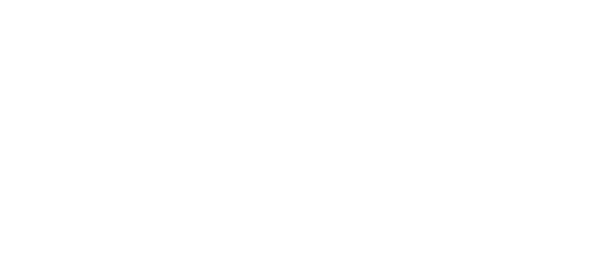
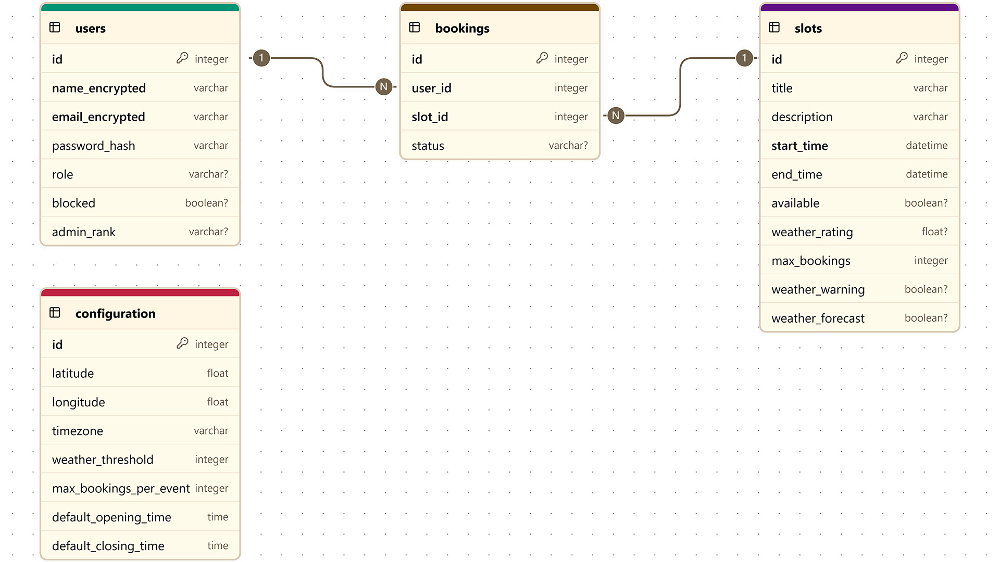
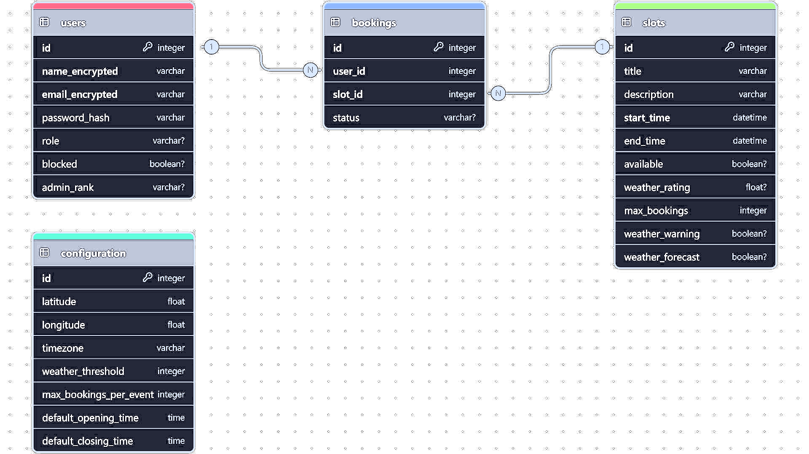

System Architecture
===================

Overview
--------

The **Observatory Booking Web App** is a modular Flask web application that supports secure, weather-aware event scheduling. It is structured with a **service-oriented architecture (SOA)**, where responsibilities are cleanly separated into services, routes, and utility modules. The application supports user authentication, booking management, real-time weather evaluation, and administrative control.

The system uses **SQLAlchemy ORM** for data persistence, **APScheduler** for background tasks (e.g., weather updates), and **Tailwind CSS** for a modern, responsive user interface.

Component Diagram
-----------------

.. image:: _static/diagrams/component_diagram_light.png
   :alt: System Component Diagram (Light)
   :class: only-light
   :align: center
   :width: 90%
   :target: _static/diagrams/component_diagram.jpg

Key Components
--------------

1. **Flask Application Core**
   - Initializes the app instance with environment-based configuration.
   - Registers routes via blueprints.
   - Manages secret keys, CSRF protection, secure session cookies, and logging.
   - Selects server runtime: Flask (development) or Waitress (production).

2. **Routes (app/routes/)**

   Modular route files for domain-specific views:

   - `authentication.py`: User login, logout, registration.
   - `admin_dashboard.py`: Admin panel and configuration tools.
   - `user_actions.py`: Booking and cancellation logic.

   Centralized registration is handled in `blueprint.py`.

3. **Service Layer (app/services/)**
   
   Encapsulates business logic, validates operations, and manages transactions:
   
   - `UserService`: Manages users actions, validation, password hashing.
   - `AdminService`: Config updates, event creation, user management.
   - `BookingService`: Event booking/cancellation with rate limiting and locking.
   - `WeatherService`: Fetches weather data, evaluates event suitability.

4. **Database Models (app/models.py)**

   SQLAlchemy models:
   
   - `User`: Encrypted PII, hashed passwords, roles.
   - `Slot`: Time-bound events with weather metrics.
   - `Booking`: Links users to slots.
   - `Configuration`: System-wide settings.
   
   Uses AES encryption for PII, bcrypt for passwords, and ORM relationships.

5. **Utilities (app/utils.py)**
   - Environment variable management.
   - Encryption utilities (AES).
   - Rate limiting with in-memory counters.
   - Caching (TTL) for repeated function calls (e.g., weather).
   - Logging setup.

6. **Templates and Static Files**
   - Jinja2 templates under `templates/` for user, admin, and error pages.
   - Tailwind CSS compiled styles, JavaScript interactivity in `static/`.

7. **Weather Integration**
   - Powered by Open-Meteo API.
   - Evaluates hourly data: cloud cover, precipitation, visibility.
   - Automatically rates events and flags poor conditions.
   - Background updates every 3 hours with caching.

Database Diagram
----------------

Concurrency and Thread Safety
-----------------------------

- **Scoped SQLAlchemy sessions** ensure isolated transactions per thread.
- **Locking mechanism** ensures safe concurrent access to sensitive operations (e.g., booking, user updates).
- APScheduler runs **weather updates in a background thread**; proper shutdown is managed with `atexit`.

Security Features
-----------------

- **PII Encryption**: AES-encrypted name and email fields.
- **Password Hashing**: bcrypt-based secure password storage.
- **Session Security**: Configurable CSRF, secure cookies, and secret keys.
- **Rate Limiting**: 10 requests per 20 seconds per user for login, bookings and cancellations.
- **Logging**: Tracks user actions, admin updates, and system errors.

Deployment Considerations
-------------------------

- Default database: SQLite (development); PostgreSQL supported for production.
- Server: Flask built-in (development), Waitress or Gunicorn (production).
- Configurable via `.env` for host, port, keys, CSRF, logging.
- Tailwind assets built via `npm run build`; deployable with CDN or local serving.

Extensibility and Maintenance
-----------------------------

- Modular structure enables easy extension of services and routes.
- DTOs (`data_transfer_objects.py`) ensure clean data flow and validation.

Conclusion
----------

This architecture ensures a **resilient, secure, and maintainable** system for observatory booking, suitable for self-hosting, institutional deployment, or integration into larger observatory management systems. The modular design allows for customization and scaling to meet varied operational requirements.
